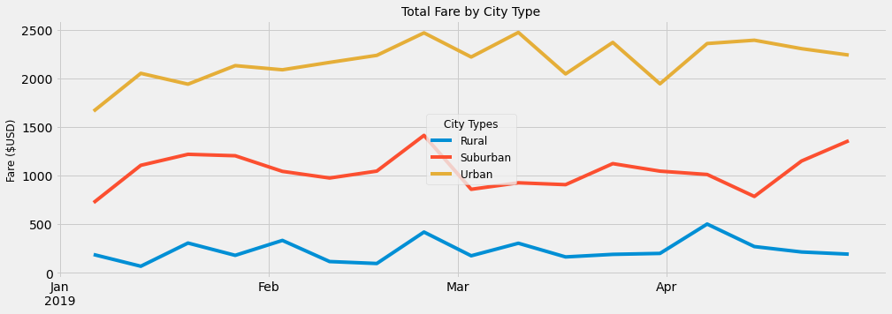

# PyBer Analysis

## Overview

### Purpose

The purpose of the analysis is to explore ride-sharing data and create a summary by city type ("Urban" (U), "Suburban" (S), "Rural" (R)) of "Total Rides" (TR), "Total Drivers" (TD), "Total Fares" (TF), "Average Fare per Ride" (AFR), and "Average Fare per Driver" (AFD), that includes a multiple line graph of of total weekly fares by city type. 

## Results

### Differences in Ride-Sharing Data between City Types

* TR: U city type has the most TR with 1,625, while R has the least with 125.
* TD: U city type has the most TD with 2,450, while R has the least with 78.
* TF: U city type has the most TF with $39,854.38, while R has the least with $4,327.93.
* AFR: R city type has the highest AFR with $34.62, while U has the lowest with $24.53.
* AFD: R city type has the highest AFD with $55.49, while U has the lowest with $16.57.

### Total Weekly Fares by City Type

## Summary

### Business Recomendatios to Address Disparities

1. The first recomendation would be to study ride distance data, to understand whether higher fares paid, as measured by AFR, in R and S, as opposed to U cities, are due to larger distances travelled or because there aren´t enough drivers, as measured by TD, to meet demand.
2. If the former (see 1.) is true, then the recomendation would be to analyze pricing for S and R cities, to determine whether it (pricing) can be managed in a more profitable manner.
3. If the latter (see 1.) is true, then the recomendation would be to agument the number of drivers in R and S cities, so as to meet the demand for rides.
